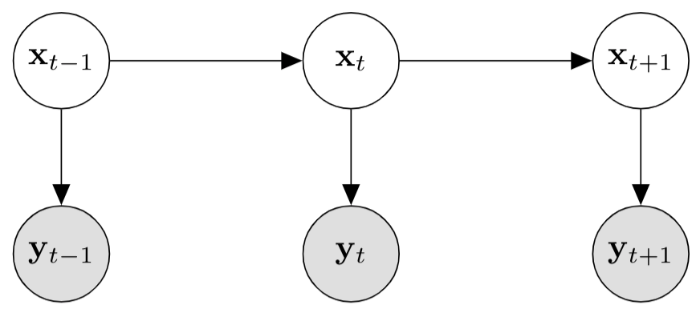

# Improved Auxiliary Particle Filters

In this post, my aims are: 
* Introduce Bayesian inference in state space models
* Introduce approximate inference using importance sampling, in state space models
* Finally, describe the Auxiliary Particle Filter, its intepretation and the recent Improved Particle Filter by Elvira et al. [1]

The ideal target reader has familiarity with Bayesian inference and basics of particle filters. However, the latter is much more optional, and if you are familiar with Bayesian inference in a "batch" setting (where data is processed all at once), you should be able to follow. If you are not, I will write a blogpost on Bayesian inference that assumes no prior background except basic rules of probability. Even then, I ambitiously hope that this post can be interesting to both Bayesian statistics experts who aren't aware of the work I will describe *and* people who see particle filters for the first time. Ah, knowing some CS may help too. It's possible, I just have to do it. 

1. [Brief introduction to sequential inference](#introduction)
    1. [General Bayesian Filtering](#sub1)
2. [Particle Filtering](#paragraph1)
3. [The Auxiliary Particle Filter and its interpretations](#paragraph2)
4. [The Improved Particle Filter through the Multiple Importance Sampling Interpretation](#paragraph3)

## Brief introduction to sequential inference 

In Bayesian inference we want to update our beliefs on the state of some random variables, which could represent parameters of a parametric statistical model or represent some unobserved data generating process. Focussing on the "updating" perspective, the step to using Bayesian methods to represent dynamical systems is quite natural. The field of statistical signal processing has been using the rule of probabilities to model object tracking, navigation and even.. spread of infectious diseases. 
The probabilistic evolution of a dynamical system is often called a *state space model*. This is just an abstraction of how we think the state of the system evolves over time. Imagine we are tracking a robot's position (x,y coordinates) and bearing: these constitute a 3 element vector. At some specific timestep, we can have a belief, i.e. a probability distribution that represents how likely we think the robot is currently assuming a certain bearing etc. If we start with a prior, and define some likelihood function/ sampling process that we believe generates what we observe, we can update our belief over the system's state with the rules of probabilty.
Let the (uknown) state of the system at time $t$ be the vector valued random variable $\mathbf{s}_{t}$.

We observe this state through a (noisy) measurement $\mathbf{v}_{t}$ (where v stands for visible). 

Now we have to start making more assumptions. What does our belief on $\mathbf{s}_{t}$ depend on ? 

Suprisingly to me, it turns out for **a lot** of applications it just needs to depend on the state at the previous timestep. 
In other words, we can say that $$\mathbf{s}_{t}$$ is sampled from some density $$f$$ conditional on $$\mathbf{s}_{t-1}$$:

$$
\mathbf{s}_{t} \sim \color{blue}{f}(\mathbf{s}_{t} \mid \mathbf{s}_{t-1})
$$

Further, usually the observation or visible is sampled according to the current state:

$$
\mathbf{v}_{t} \sim \color{green}{g}(\mathbf{v}_{t} \mid \mathbf{s}_{t})
$$

It is reasonable to assume this: if we take a measurement, we don't expect its outcome to be dependent on previous states of the system, just the current one ($$\color{blue}{f}$$ and $$\color{green}{g}$$ seem arbitrary but they are common in the literature). For example, a classic Gaussian likelihood for would imply that the belief over $$\mathbf{v}_{t}$$ is a Normal with a mean being a linear combination of the state's coordinates.

These collection of random variables and densities define the state space model completely. It is worth, if you see this for the first time, reflecting on the particular assumptions we are making. How the belief on $\mathbf{s}$ evolves with time could depend on many previous states; the measurement could depend on previous measurements, if we had a sensor that degrades over time, etc... I am not great at giving practical examples, but if you are reading this, you should be able to see that this can be generalized in several ways. 
Note that a lot of the structure comes from assuming some variables are statistically independent from others. The field of probabilistic graphical models is dedicated to representing statistical independencies in the form of graphs (nodes and edges). One benefit of the graphical representation is that it makes immediately clear how flexible we could be. 

In short, when the transition density and the observation densities are linear combination of their inputs with additive, i.i.d. Gaussian noise, then the state space model is often called a Linear Dynamical System (LDS). When variables are discrete, it is often called Hidden Markov Model (HMM). These are just labels. 

There are several tasks that we can perform on the state space model described above. Each of these has a fancy name, but you should recall that technically all we are doing is applying the sum and product rules. These tasks are just associated to a *target* distribution which is the object of interest that we want to compute. Let's list some of these: 

  <b>Filtering</b>: The target distributions are of the form: $p\left(\mathbf{s}_{t} | \mathbf{v}_{1: t}\right), \quad t=1, \ldots, T$. This represents what we have learnt about the system's state at time $t$, after observations up to $t$. 

  <b>Smoothing</b>:  The target distributions are of the form: $p\left(\mathbf{s}_{t} | \mathbf{v}_{1: T}\right), \quad t=1, \ldots, T$. This represent what we have learnt about the system's state after observing the *complete* sequence of measurements, and revised the previous beliefs obtained by filtering.  

<b>Parameter Estimation</b>: The target distributions are of the form: $p\left(\boldsymbol{\theta} | \mathbf{v}_{1: T}\right)= \int p\left(\mathbf{s}_{0: T}, \boldsymbol{\theta} | \mathbf{v}_{1: T}\right) \mathrm{d} \mathbf{s}_{0: T}$. The parameters $\boldsymbol{\theta}$ represent all the parameters of any parametric densities in the state space model. In the case that the transition and/or observation densities are parametric, and parameters are unknown, we can learn them from data by choosing those that both explain the observations well and also agree with our prior beliefs. Parameter estimation is sometimes referred to as *learning*, because parameters describe properties of sensors that can be estimated from data with machine learning methods. So, it is called learning just because it is cool.  

### General Bayesian Filtering 

#### Some notation
- The notation $$\mathbf{v}_{1:t}$$ means a set of vectors $$ \left \{ \mathbf{v}_1, \mathbf{v}_2, \dots, \mathbf{v}_t \right \}$$
- Therefore, $$ p\left ( \mathbf{v}_{1:t} \right )$$ is a joint distribution: $$p\left ( \mathbf{v}_1, \mathbf{v}_2, \dots, \mathbf{v}_t \right ) $$

In this post, I am only concerned with filtering, and will always assume that any parameters of transition or observation densities are known in advance. 
Let's derive how to find the filtering distribution in the state space model described without many assumption on the densities.
Recall that the aim is to compute: $$ p\left(\mathbf{s}_{t} | \mathbf{v}_{1: t}\right)$$. Apply Bayes rule:  

$$
p\left(\mathbf{s}_{t} | \mathbf{v}_{1:t}\right) = \frac{ p \left( \mathbf{v}_{t} \mid \mathbf{s}_{t}, \mathbf{v}_{1:t-1} \right ) p\left( \mathbf{s}_{t} \mid \mathbf{v}_{1:t-1} \right ) }{p\left( \mathbf{v}_t \mid \mathbf{v}_{1:t-1} \right )} = \frac{  \color{green}{g}\left( \mathbf{v}_{t} \mid \mathbf{s}_{t} \right ) p\left( \mathbf{s}_{t} \mid \mathbf{v}_{1:t-1} \right ) }{p\left( \mathbf{v}_t \mid \mathbf{v}_{1:t-1} \right )}
$$

If this equation is confusing, think of the previous measurements $$\mathbf{v}_{1:t-1}$$ as just a "context", that is always on the conditioning side, a required "input" to all densities involved, with Bayes rule being applied to $$\mathbf{s}_{t}$$ and $$\mathbf{v}_{t}$$.
We know the current measurements only depends on the state, therefore $$p \left( \mathbf{v}_{t} \mid \mathbf{s}_{t}, \mathbf{v}_{1:t-1} \right ) = p \left( \mathbf{v}_{t} \mid \mathbf{s}_{t} \right ) = \color{green}{g}( \mathbf{v}_{t} \mid \mathbf{s}_{t} )$$, and only the right term in the numerator is left to compute. This term is a marginal of $$ \mathbf{s}_t$$, which means we have to integrate out anything else. If we were doing this very naively, each time we would integrate out all previous states, but by caching results a.k.a. Dynamic Programming, we only need to marginalize the previous state: 

$$
  p\left( \mathbf{s}_{t} \mid \mathbf{v}_{1:t-1} \right ) = \int p\left( \mathbf{s}_{t}, \mathbf{s}_{t-1} \mid \mathbf{v}_{1:t-1} \right ) \mathrm{d}\mathbf{s}_{t-1}
$$

Then we split the joint with the product rule and exploit remember that the states are independent of previous measurements:

$$
\int p\left( \mathbf{s}_{t}, \mathbf{s}_{t-1} \mid \mathbf{v}_{1:t-1} \right ) \mathrm{d}\mathbf{s}_{t-1} = 
\int p\left( \mathbf{s}_{t} \mid  \mathbf{s}_{t-1}, \mathbf{v}_{1:t-1} \right ) p(\mathbf{s}_{t-1} \mid \mathbf{v}_{1:t-1}) \mathrm{d}\mathbf{s}_{t-1} 
$$

$$
= \int p\left( \mathbf{s}_{t} \mid  \mathbf{s}_{t-1} \right ) p(\mathbf{s}_{t-1} \mid \mathbf{v}_{1:t-1}) \mathrm{d}\mathbf{s}_{t-1} = \int \color{blue}{f}\left( \mathbf{s}_{t} \mid  \mathbf{s}_{t-1} \right ) p(\mathbf{s}_{t-1} \mid \mathbf{v}_{1:t-1}) \mathrm{d}\mathbf{s}_{t-1}
$$

And we are done, if you notice that the right side term in the integral is the filtering distribution at $$t-1$$, which we have already computed. 
In the literature names are given to the step that requires computing $$ p\left( \mathbf{s}_{t} \mid \mathbf{v}_{1:t-1} \right )$$ called *prediction*, because it's our belief on $$ \mathbf{s}_{t}$$ before observing the currrent measurement, and *correction* is the name given to the step $$ p\left(\mathbf{s}_{t} | \mathbf{v}_{1:t}\right) \propto \color{green}{g}\left( \mathbf{v}_{t} \mid \mathbf{s}_{t} \right ) \cdot p\left( \mathbf{s}_{t} \mid \mathbf{v}_{1:t-1} \right )$$, because we "correct" our prediction by taking into account the measurement. 

Note that most particle filtering methods, which we will describe later, actually do not compute the filtering distribution with these two steps just described. Instead, they use the following recursion: 

\begin{equation}
p(\mathbf{s}_{1:t}, \mathbf{v}_{1:t}) p(\mathbf{s}_{1:t}, \mathbf{v}_{1:t})
\end{equation}

In a LDS, all computations have closed form solutions, and this algorithm instantiates into the *Kalman Filter*. For discrete  valued random variables, if the dimensionalities are small we can also do exact computations and the label this time is *Forward-Backward* algorithm for HMMs. 
When variables are non-Gaussian and/or transition/observation densities are nonlinear function of their inputs, we have to perform approximate inference. 
By far the most popular method is to use Monte Carlo approximations, and more specifically importance sampling. When we use importance sampling to approximate the filtering distribution, this is called *particle filtering*. 

## Particle filtering 

Recall that we can approximate 
\begin{equation}
\color[rgb]{1,0,0}{f(x)}
\end{equation}

## The Auxiliary Particle Filter and its interpretations 

## The Improved Particle Filter through the Multiple Importance Sampling Interpretation 

## References 
1. Elvira, V., Martino, L., Bugallo, M.F. and Djurić, P.M., 2018, September. In search for improved auxiliary particle filters. In 2018 26th European Signal Processing Conference (EUSIPCO) (pp. 1637-1641). IEEE.
2. Doucet, A. and Johansen, A.M., 2009. A tutorial on particle filtering and smoothing: Fifteen years later. Handbook of nonlinear filtering, 12(656-704), p.3.
3. Särkkä, S., 2013. Bayesian filtering and smoothing (Vol. 3). Cambridge University Press.

